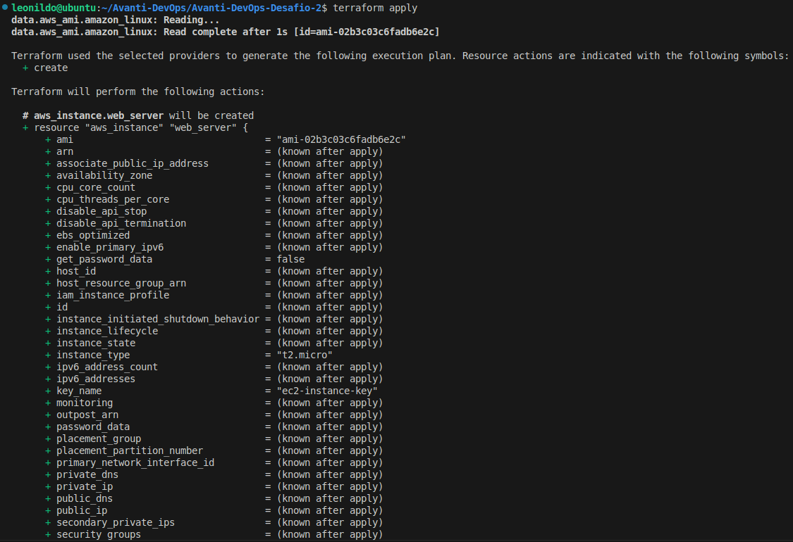
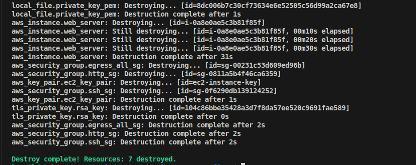

# Aula 3 - IAC com Terraform e AWS [2º DESAFIO]


Segundo desafio do BootCamp DevOps do Instituto Atlântico.

Neste repositório, **explorei** o uso de **Terraform** e **AWS - Amazon Web Services** para criar e gerenciar máquinas virtuais. Também **realizei** o deploy do site "Explore o poder da Nuvem".

---

## Sumário

- [Pré-requisitos](#pré-requisitos)
- [Passo a passo](#passo-a-passo)

---

## Pré-requisitos

- [Terraform](https://developer.hashicorp.com/terraform/downloads?product_intent=terraform)
- [AWS CLI](https://docs.aws.amazon.com/cli/latest/userguide/getting-started-install.html)
- [Visual Studio Code](https://code.visualstudio.com) (Já com uma chave de acesso configurada)

---

## Passo a passo

1.  **Clonando o repositório que contém o playbook.yaml e o user_data.sh, os arquivos estão neste repositório, caso queira acessar:**

    ```bash
    git clone https://gitlab.com/avanti-dvp/iac-com-terraform-e-aws.git
    ```

2.  **Primeiro, criei o arquivo provider.tf. Nele, eu configurei o provedor AWS, definindo a região onde toda a infra seria criada, garantindo que o Terraform soubesse para onde enviar os comandos:**

    ```hcl
      terraform {
          required_providers {
              aws = {
                  source  = "hashicorp/aws"
                  version = "~> 5.0"
              }
          }
      }

      provider "aws" {
          region = "us-east-1"
      }
      ```


3.  **Em seguida, veio o key_pair.tf. Este arquivo foi essencial para que eu pudesse acessar minhas instâncias EC2 com segurança. Eu o usei para gerar um par de chaves RSA e, mais importante, para criar o Key Pair na AWS e salvar a chave privada localmente com as permissões corretas:**

    ```hcl
    # Gera uma chave privada RSA de 4096 bits
    resource "tls_private_key" "rsa_key" {
        algorithm = "RSA"
        rsa_bits  = 4096
    }

    # Cria o Key Pair na AWS usando a chave pública gerada
    resource "aws_key_pair" "ec2_key_pair" {
        key_name   = "ec2-instance-key" # Nome do key pair na AWS
        public_key = tls_private_key.rsa_key.public_key_openssh
    }

    # Salva a chave privada em um arquivo local
    resource "local_file" "private_key_pem" {
        content  = tls_private_key.rsa_key.private_key_pem
        filename = "${path.module}/ec2-instance-key.pem"

        # Define as permissões do arquivo para que apenas o proprietário possa ler e escrever
        file_permission = "0600"
    }
    ```

4.  **Depois, criei o security_group.tf. Este foi crucial para definir as regras de rede. Nele, configurei três grupos de segurança: um para permitir tráfego HTTP (porta 80), outro para SSH (porta 22, liberando apenas meu IP para segurança) e um terceiro para permitir todo o tráfego de saída. Isso me deu controle total sobre as conexões:**
    ```hcl
    # 1. Security Group para liberar a porta 80 (HTTP) para qualquer origem
    resource "aws_security_group" "http_sg" {
        name        = "allow-http-sg"
        description = "Allow HTTP inbound traffic"

        ingress {
            from_port   = 80
            to_port     = 80
            protocol    = "tcp"
            cidr_blocks = ["0.0.0.0/0"]
        }

        tags = {
            Name = "allow-http"
        }
    }

    # 2. Security Group para liberar a porta 22 (SSH) para um IP específico
    resource "aws_security_group" "ssh_sg" {
        name        = "allow-ssh-sg"
        description = "Allow SSH inbound traffic from a specific IP"

        ingress {
            from_port   = 22
            to_port     = 22
            protocol    = "tcp"
            cidr_blocks = [var.meu_ip_publico]
        }

        tags = {
            Name = "allow-ssh"
        }
    }

    # 3. Security Group para liberar todo o tráfego de saída (Egress)
    resource "aws_security_group" "egress_all_sg" {
        name        = "allow-all-egress-sg"
        description = "Allow all outbound traffic"

        egress {
            from_port   = 0
            to_port     = 0
            protocol    = "-1" # "-1" representa todos os protocolos
            cidr_blocks = ["0.0.0.0/0"]
        }

        tags = {
            Name = "allow-all-egress"
        }
    }
    ```

    > [!TIP]
    > O arquivo `security_group.tf` é o arquivo que define a criação dos security groups na AWS.

5.  **O arquivo data.tf foi um atalho inteligente. Em vez de procurar manualmente o ID da AMI (Amazon Machine Image) mais recente do Amazon Linux, eu usei este arquivo para que o Terraform buscasse automaticamente a AMI mais atual, garantindo que minha instância sempre usasse a versão mais recente e segura:**

     ```hcl
    data "aws_ami" "amazon_linux" {
        most_recent = true
        owners      = ["amazon"]

        filter {
            name   = "name"
            values = ["amzn2-ami-hvm-*-x86_64-gp2"]
        }
    }
    ```

    > [!TIP]
    > O arquivo `data.tf` é o arquivo que define um datasource responsável por buscar o id da imagem (AMI) mais recente do Amazon Linux 2.


6.  **Com tudo pronto, criei o coração da minha infraestrutura: o ec2.tf. Aqui, eu especifiquei os detalhes da minha instância EC2, como o tipo (t2.micro), a AMI que o data.tf encontrou, e associei os grupos de segurança que havia criado. Também inseri o user_data.sh para a configuração inicial da máquina:**
    ```hcl
    # Cria a instância EC2
    resource "aws_instance" "web_server" {
        ami           = data.aws_ami.amazon_linux.id
        instance_type = "t2.micro"
        user_data     = base64encode(file("user_data.sh"))

        # Define o key pair para a instância
        key_name      = aws_key_pair.ec2_key_pair.key_name

        # Associa os 3 Security Groups à instância
        vpc_security_group_ids = [
            aws_security_group.http_sg.id,
            aws_security_group.ssh_sg.id,
            aws_security_group.egress_all_sg.id
        ]

        tags = {
            Name = "WebServer-DVP"
        }
    }
    ```

    > [!TIP]
    > O arquivo `ec2.tf` é o arquivo que define a criação da instância EC2 na AWS.

7.  **Para ter visibilidade do que foi criado, adicionei o outputs.tf. Com ele, consigo ver facilmente o IP público da instância e a URL do site assim que o Terraform termina a aplicação, o que é muito prático para testar:**
    ```hcl
    # Bloco para exibir o IP público da instância após a criação
    output "instance_public_ip" {
      description = "IP público da instância EC2"
      value       = aws_instance.web_server.public_ip
    }

    output "website_url" {
        description = "URL do site provisionado."
        value       = "http://${aws_instance.web_server.public_ip}"
    }
    ```

    > [!TIP]
    > O arquivo `outputs.tf` é o arquivo que define as saídas que serão exibidas após a criação da infraestrutura, nesse caso, o IP público da instância EC2.

8. **Por fim, o variables.tf me permitiu definir variáveis, como o meu IP público, tornando o código mais flexível e reutilizável, sem precisar alterar valores diretamente nos recursos:**
    ```hcl
    variable "meu_ip_publico" {
        type        = string
        description = "Endereço IP público para o Security Group SSH"
        # IMPORTANTE: Substitua pelo seu endereço IP público
        # Para saber o seu IP público, acesse [https://www.whatismyip.com/](https://www.whatismyip.com/)
        default     = "203.0.113.25/32"
    }
    ```

    > [!TIP]
    > O arquivo `variables.tf` é o arquivo que define as variáveis que serão usadas na infraestrutura, nesse caso, o IP público para o Security Group SSH.
  9. **Agora vamos iniciar o fluxo de trabalho do Terraform para criar a infraestrutura na nuvem:**
      ```bash
        terraform init
        terraform plan
        terraform apply
        ```
      > [!NOTE]
      > O comando `terraform init` inicializa o Terraform e baixa os providers necessários para a criação da infraestrutura na nuvem.
      

      > [!NOTE]
      > O comando `terraform plan` cria um plano de execução que mostra as alterações que serão feitas na infraestrutura na nuvem.
      
      

      > [!NOTE]
      > O comando `terraform apply` aplica as configurações definidas nos arquivos .tf e cria a infraestrutura na nuvem.
      
      

      > [!NOTE]
      > Se tudo rodar com sucesso, você verá o IP público da instância EC2 e a URL do site provisionado, basta acessá-lo através dessa URL no seu navegador para ver o site está no ar.
      
  10. **Resultado:**
      
      > [!NOTE]
      > O mesmo IP recebido pelo output, é o IP de acesso ao site carregado.

  11. **Para destruir a infraestrutura na nuvem, execute o comando abaixo:**
      ```bash
      terraform destroy
      ```

      
      

      > [!NOTE]
      > O comando `terraform destroy` destrói a infraestrutura na nuvem que foi criada pelo Terraform.
      > **RECOMENDADO:** Sempre que você criar uma infraestrutura na nuvem, certifique-se de destruí-la quando não estiver mais usando.

## Saiba mais

- [Documentação do Terraform](https://developer.hashicorp.com/terraform)
- [Documentação do Provider AWS do Terraform](https://registry.terraform.io/providers/hashicorp/aws/latest/docs)
- [Lista de Providers do Terraform](https://registry.terraform.io/browse/providers)
- [Documentação da AWS](https://docs.aws.amazon.com/pt_br/)


## Projeto individual

Este projeto foi desenvolvido com base em conceitos aprendidos durante o bootcamp, visando simplicidade e eficiência. Para eventuais dúvidas ou melhorias, sinta-se à vontade para entrar em contato.

### Contato:

- **E-mail**: leonildolinck@gmail.com
- **Discord**: leonildo